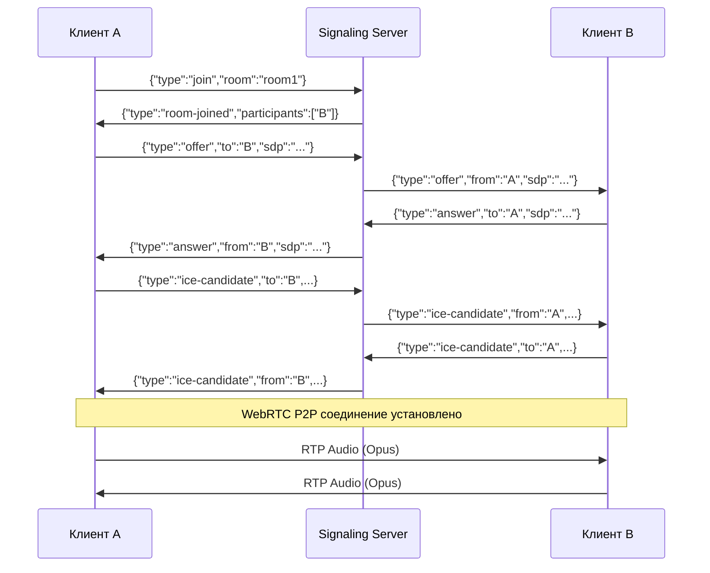

# Архитектура голосовой связи (Mesh топология)

## Протокол сообщений (WebSocket signaling)

### 1. Присоединение к комнате
```json
// Клиент -> Сервер
{"type":"join","room":"test-room"}

// Сервер -> Клиент (список участников)
{"type":"room-joined","room":"test-room","participants":["user2","user3"]}

// Сервер -> Другие участники (о новом клиенте)
{"type":"user-joined","userId":"user1"}
```

### 2. WebRTC Handshake (SDP Offer/Answer)
```json
// Инициатор -> Сервер -> Получатель
{"type":"offer","from":"user1","to":"user2","sdp":"v=0..."}

// Получатель -> Сервер -> Инициатор
{"type":"answer","from":"user2","to":"user1","sdp":"v=0..."}
```

### 3. ICE Candidates
```json
{"type":"ice-candidate","from":"user1","to":"user2","candidate":"candidate:..."}
```

### 4. Выход из комнаты
```json
// Клиент -> Сервер
{"type":"leave"}

// Сервер -> Другие участники
{"type":"user-left","userId":"user1"}
```

## Классы клиента

### AudioCapture
```cpp
class AudioCapture : public QObject {
    // Захват аудио через QAudioInput
    // Кодирование в Opus (через libdatachannel или opus библиотеку)
signals:
    void audioDataReady(const QByteArray& data, int samples);
public slots:
    void startCapture();
    void stopCapture();
    void setMuted(bool muted);
};
```

### WebRTCManager
```cpp
class WebRTCManager : public QObject {
    // Управляет PeerConnection для каждого участника комнаты
    // Карта: userId -> PeerConnection
signals:
    void signalingMessage(const QJsonObject& msg);  // Отправка через WebSocket
    void peerConnected(const QString& userId);
    void peerDisconnected(const QString& userId);
    void audioReceived(const QString& userId, const QByteArray& data);
public slots:
    void joinRoom(const QString& roomId, const QStringList& participants);
    void createOffer(const QString& userId);        // Для нового участника
    void handleOffer(const QString& from, const QString& sdp);
    void handleAnswer(const QString& from, const QString& sdp);
    void handleIceCandidate(const QString& from, const QString& candidate);
    void removePeer(const QString& userId);
};
```

### SignalingClient (модифицированный)
```cpp
class SignalingClient : public QWidget {
    // Существующий WebSocket клиент
    // + интеграция с WebRTCManager
    // + UI для голосового чата
private:
    QWebSocket* socket_;
    WebRTCManager* webrtc_;
    AudioCapture* audio_;
    // ... UI элементы для голосового чата
};
```

## Порядок инициализации соединения (Mesh)

```
Клиент A присоединяется к комнате с [B, C]:

1. A подключается к signaling серверу
2. A отправляет {"type":"join","room":"room1"}
3. Сервер отвечает {"type":"room-joined","participants":["B","C"]}
4. A создает PeerConnection для B и C
5. Для каждого участника:
   - A создает offer -> отправляет через signaling
   - Получатель отвечает answer
   - Обмен ICE candidates
   - P2P соединение установлено

Новый участник D присоединяется:

1. Сервер рассылает {"type":"user-joined","userId":"D"}
2. A, B, C создают offer для D
3. D отвечает answer каждому
4. У D теперь 3 PeerConnection (с A, B, C)
```

## Диаграмма потока данных



## Зависимости CMake

```cmake
# client/CMakeLists.txt
find_package(Qt6 COMPONENTS Core Gui Widgets WebSockets Multimedia REQUIRED)

# libdatachannel уже подключена
```

## Примечания

1. **Opus кодирование**: libdatachannel использует встроенный Opus, либо можно использовать opus библиотеку напрямую через QAudioDecoder

2. **ICE серверы**: Для NAT traversal нужны STUN/TURN серверы:
   - Публичные: stun.l.google.com:19302
   - Или собственный TURN для production

3. **Аудио параметры**:
   - Sample rate: 48000 Hz (Opus native)
   - Channels: 1 (mono) или 2 (stereo)
   - Frame size: 20ms (960 samples at 48kHz)
